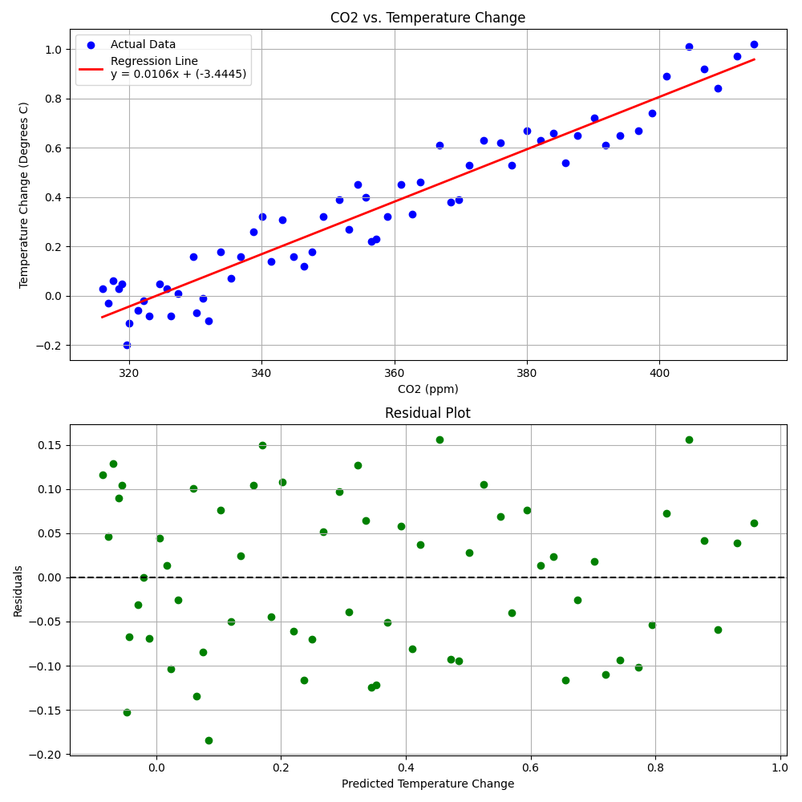

CO\ :sub:`2` vs. Global Temperature Analysis
================================================

This repository provides a mathematical and visual analysis of the relationship between atmospheric CO\ :sub:`2` concentrations and global surface air temperature changes from 1959 to the present.

Overview
--------

The project utilizes data from NOAA and other scientific sources to quantify the correlation between carbon emissions and global warming. It includes statistical modeling, standardization techniques, and high-quality animations to explain the underlying concepts.

Key Features
------------

* **Linear Regression**: Quantifies the relationship using scikit-learn.
* **Z-Score Normalization**: Standardizes disparate units (ppm vs. Celsius) for direct trend comparison.
* **Manim Explainers**: High-quality visual narratives of the mathematical processes.
* **High-Definition Visuals**: Publication-ready plots generated with Matplotlib.

Data Sources
------------

The analysis uses the following datasets located in the ``data/`` directory:

- ``co2-ppm.csv``: Yearly atmospheric CO\ :sub:`2` levels (ppm).
- ``surface-air-temp-change.csv``: Yearly global temperature change (Degrees C).

Usage
-----

Analysis Scripts
~~~~~~~~~~~~~~~~

To run the primary linear regression analysis:

.. code-block:: bash

    python3 linear.py

To run the Z-score standardization and comparison:

.. code-block:: bash

    python3 zscore_analysis.py

Manim Explainers
~~~~~~~~~~~~~~~~

To render the linear regression explainer:

.. code-block:: bash

    manim -qh linear-explainer.py LinearRegressionExplainer

To render the Z-score normalization explainer:

.. code-block:: bash

    manim -qh zscore-explainer.py ZScoreExplainer

Output Files
------------

- ``regression_analysis.png``: HD plot of the linear fit and residuals.
- ``zscore_comparison.png``: HD plot of the standardized trend comparison.
- ``media/videos/``: Directory containing the rendered Manim animations.

Requirements
------------

- Python 3.x
- NumPy
- Matplotlib
- Scikit-learn
- Manim (for animations)
- LaTeX (e.g., BasicTeX for math rendering)
